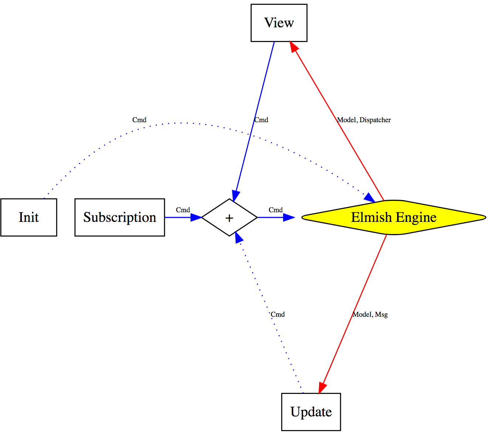

- title : Introduction to F# and Fable
- description : Introduction to F# and Fable
- author : MECU Mihai-Sorin
- theme : night
- transition : default

***

# F# and Fable

***

## BIO: 
Black belt with several dans at Copy-Pasta.

Joke aside ample experience developing WORKING solutions. Enthusiast about Machine Learning.

You can reach me by:

* Email: mecumihaisorin_at_gmail_dot_com

* Twitter: @mecusorin

---

## Warning For Yawning

I know is late, but I will show you kittens pictures

***

## Agenda
 * F# setup
 * F# basics
 * What is Fable
 * Interracting with Javascript
 * Elmish
 * Elmish demo

***

## My F# setup
* Install [Dot.Net Core](http://dot.net)
* [FAKE](https://fake.build/fake-gettingstarted.html) - build utility with DSL in F#

        dotnet tools install fake-cli -g

* [Paket](https://fsprojects.github.io/Paket/) - packet manager (better than NuGet)

        dotnet tools install paket -g

* Install [VS Code](https://code.visualstudio.com/) editor

    In VS Code add the extensions
        * Ionide-fsharp
        * Ionide-Paket
        * Ionide-FAKE

---

### FAKE

"FAKE - F# Make" is a cross platform build automation system. Due to its integration in F#, all benefits of the .NET Framework and functional programming can be used, including the extensive class library, powerful debuggers and integrated development environments like Visual Studio or MonoDevelop, which provide syntax highlighting and code completion.

The new DSL was designed to be succinct, typed, declarative, extensible and easy to use.

---

### Paket
*Paket* is a dependency manager for .NET and mono projects, which is designed to work well with NuGet packages and also enables referencing files directly from Git repositories or any HTTP resource. 

It enables precise and predictable control over what packages the projects within your application reference.

---

### VS Code

Important configuration of Ionide extension

#####FSharp: Fsac Runtime
Choose the `NetCore` runtime of FsAutocomplete (FSAC). Requires restart

***

# F# basics
(I will skim the surface)

---

* `Spaces` not Tabs
* Imutability as default. There is a way to make a mutable variable, but I will not show it to you
* Type inference

---

### Comments

Block comments are placed between `(*` and `*)`.

    (* This is block comment *)

Line comments start from `//` and continue until the end of the line.

    // And this is line comment

XML doc comments come after `///` allowing us to use XML tags to generate documentation.

    /// The `let` keyword defines an (immutable) value
    let result = 1 + 1 = 2

---

### Basic Types and Literals
F# `string` type is an alias for `System.String` type.

    /// Create a string using string concatenation
    let hello = "Hello" + " World"

Most numeric types have associated suffixes, e.g., `uy` for unsigned 8-bit integers and `L` for signed 64-bit integer. Other common examples are `F` or `f` for 32-bit floating-point numbers, `M` or `m` for decimals, and `I` for big integers.

    let b, i, l = 86uy, 86, 86L
    let s, f, d, bi = 4.14F, 4.14, 0.7833M, 9999I
    // [fsi:val b : byte = 86uy]
    // [fsi:val i : int = 86]
    // [fsi:val l : int64 = 86L]
    // [fsi:val s : float32 = 4.14f]
    // [fsi:val f : float = 4.14]
    // [fsi:val d : decimal = 0.7833M]
    // [fsi:val bi : System.Numerics.BigInteger = 9999]

See [Literals (MSDN)](http://msdn.microsoft.com/en-us/library/dd233193.aspx) for complete reference.

---

### Functions
The `let` keyword also defines named functions.

    let negate x = x * -1 
    let square x = x * x 
    let print x = printfn "The number is: %d" x

    let squareNegateThenPrint x = 
        print (negate (square x))

Anonimous functions are declared with the `fun` keyword.

    List.map (fun x -> 2 * x) [1..10]

---

### Pipe and composition operators
Pipe operator `|>` is used to chain functions and arguments together. Double-backtick identifiers are handy to improve readability especially in unit testing:

    let ``square, negate, then print`` x = 
        x |> square |> negate |> print

This operator is essential in assisting the F# type checker by providing type information before use:

    let sumOfLengths (xs : string []) = 
        xs 
        |> Array.map (fun s -> s.Length)
        |> Array.sum

Composition operator `>>` is used to compose functions:

    let squareNegateThenPrint' =
        square >> negate >> print

---

### Recursive functions
The `rec` keyword is used together with the `let` keyword to define a recursive function:

    let rec fact x =
        if x < 1 then 1
        else x * fact (x - 1)

*Mutually recursive* functions (those functions which call each other) are indicated by `and` keyword:

    let rec even x =
        if x = 0 then true
        else odd (x - 1)

    and odd x =
        if x = 0 then false
        else even (x - 1)

---

    let a = 5
    let factorial x = [1..x] |> List.reduce (*)
    let c = factorial a
    //[fsi:c]
    (** 
    `c` is evaluated for you
    *)
    (*** include-value: c ***)

---

### Pattern matching
Pattern matching is often facilitated through `match` keyword.

    let rec fib n =
        match n with
        | 0 -> 0
        | 1 -> 1
        | _ -> fib (n - 1) + fib (n - 2)

In order to match sophisticated inputs, one can use `when` to create filters or guards on patterns:

    let sign x = 
        match x with
        | 0 -> 0
        | x when x < 0 -> -1
        | x -> 1

---

Pattern matching can be done directly on arguments:

    let fst' (x, _) = x

or implicitly via `function` keyword:

    /// Similar to `fib`; using `function` for pattern matching
    let rec fib' = function
        | 0 -> 0
        | 1 -> 1
        | n -> fib' (n - 1) + fib' (n - 2)

For more complete reference visit [Pattern Matching (MSDN)](http://msdn.microsoft.com/en-us/library/dd547125.aspx).

--- 

### Lists
A *list* is an immutable collection of elements of the same type.

    // Lists use square brackets and `;` delimiter
    let list1 = [ "a"; "b" ]
    // :: is prepending
    let list2 = "c" :: list1
    // @ is concat
    let list3 = list1 @ list2

    // Recursion on list using (::) operator
    let rec sum list = 
        match list with
        | [] -> 0
        | x :: xs -> x + sum xs

---

### Arrays
*Arrays* are fixed-size, zero-based, mutable collections of consecutive data elements.

    // Arrays use square brackets with bar
    let array1 = [| "a"; "b" |]
    // Indexed access using dot
    let first = array1.[0]

---

### Sequences
A *sequence* is a logical series of elements of the same type. Individual sequence elements are computed only as required, so a sequence can provide better performance than a list in situations in which not all the elements are used.

    // Sequences can use yield and contain subsequences
    let seq1 = 
        seq {
            // "yield" adds one element
            yield 1
            yield 2

            // "yield!" adds a whole subsequence
            yield! [5..10]
        }

---

### Higher-order functions on collections
The same list `[ 1; 3; 5; 7; 9 ]` or array `[| 1; 3; 5; 7; 9 |]` can be generated in various ways.

 * Using range operator `..`

        let xs = [ 1..2..9 ]

 * Using list or array comprehensions

        let ys = [| for i in 0..4 -> 2 * i + 1 |]

 * Using `init` function

        let zs = List.init 5 (fun i -> 2 * i + 1)

---

### Higher-order functions for collection manipulation

* `fold` starts from the left of the list (or array) and `foldBack` goes in the opposite direction

        let xs' = Array.fold (fun str n -> 
                    sprintf "%s,%i" str n) "" [| 0..9 |]

* `reduce` doesn't require an initial accumulator

        let last xs = List.reduce (fun acc x -> x) xs

* `map` transforms every element of the list (or array)

        let ys' = Array.map (fun x -> x * x) [| 0..9 |]

* `iter`ate through a list and produce side effects

        let _ = List.iter (printfn "%i") [ 0..9 ] 

---

All these operations are also available for sequences. The added benefits of sequences are laziness and uniform treatment of all collections implementing `IEnumerable<'T>`.

    let zs' =
        seq { 
            for i in 0..9 do
                printfn "Adding %d" i
                yield i
        }

---

### Tuples

A *tuple* is a grouping of unnamed but ordered values, possibly of different types:

    // Tuple construction
    let x = (1, "Hello")

    // Triple
    let y = ("one", "two", "three") 

    // Tuple deconstruction / pattern
    let (a', b') = x

---

The first and second elements of a tuple can be obtained using `fst`, `snd`, or pattern matching:

    let c' = fst (1, 2)
    let d' = snd (1, 2)

    let print' tuple =
        match tuple with
        | (a, b) -> printfn "Pair %A %A" a b

---

### Records
*Records* represent simple aggregates of named values, optionally with members:

    // Declare a record type
    type Person = { Name : string; Age : int }

    // Create a value via record expression
    let paul = { Name = "Paul"; Age = 28 }

    // 'Copy and update' record expression
    let paulsTwin = { paul with Name = "Jim" }

---

*Records* can be augmented with properties and methods:

    type Person with
        member x.Info = (x.Name, x.Age)

Records are essentially sealed classes with extra topping: default immutability, structural equality, and pattern matching support.

    let isPaul person =
        match person with
        | { Name = "Paul" } -> true
        | _ -> false

---

### Discriminated unions (DU)
*Discriminated unions* provide support for values that can be one of a number of named cases, each possibly with different values and types.

    type Tree<'T> =
        | Node of Tree<'T> * 'T * Tree<'T>
        | Leaf

    let rec depth = function
        | Node(l, _, r) -> 1 + max (depth l) (depth r)
        | Leaf -> 0

---

F# Core has a few built-in discriminated unions for error handling, e.g., [Option](http://msdn.microsoft.com/en-us/library/dd233245.aspx) and [Choice](http://msdn.microsoft.com/en-us/library/ee353439.aspx).

    let optionPatternMatch input =
        match input with
        | Some i -> printfn "input is an int=%d" i
        | None -> printfn "input is missing"

---

Single-case discriminated unions are often used to create type-safe abstractions with pattern matching support:

    type OrderId = Order of string

    // Create a DU value
    let orderId = Order "12"

    // Use pattern matching to deconstruct single-case DU
    let (Order id) = orderId

---

### Exceptions
The `failwith` function throws an exception of type `Exception`.

    let divideFailwith x y =
        if y = 0 then 
            failwith "Divisor cannot be zero." 
        else x / y

---

Exception handling is done via `try/with` expressions.

    let divide x y =
        try
            Some (x / y)
        with :? System.DivideByZeroException -> 
            printfn "Division by zero!"
            None

--- 

The `try/finally` expression enables you to execute clean-up code even if a block of code throws an exception. Here's an example which also defines custom exceptions.

    exception InnerError of string
    exception OuterError of string

    let handleErrors x y =
        try 
            try 
            if x = y then raise (InnerError("inner"))
            else raise (OuterError("outer"))
            with InnerError(str) -> 
                printfn "Error1 %s" str
        finally
            printfn "Always print this."

---

### Classes and Inheritance

This example is a basic class.

    type Vector(x : float, y : float) =
        let mag = sqrt(x * x + y * y) // local let binding
        member this.X = x             // properties
        member this.Y = y
        member this.Mag = mag
        member this.Scale(s) =        // member methods (instance)
            Vector(x * s, y * s)
        static member (+) (a : Vector, b : Vector) = // static member methods
            Vector(a.X + b.X, a.Y + b.Y)

---

Call a base class from a derived one.

    type Animal() =
        member __.Rest() = ()
                
    type Dog() =
        inherit Animal()
        member __.Run() =
            base.Rest()

---

*Upcasting* is denoted by `:>` operator.

    let dog = Dog() 
    let animal = dog :> Animal

*Dynamic downcasting* (`:?>`) might throw an `InvalidCastException` if the cast doesn't succeed at runtime.

    let shouldBeADog = animal :?> Dog

---

### Interfaces
Declare `IVector` interface and implement it in `Vector'`.

    type IVector =
        abstract Scale : float -> IVector

    type Vector'(x, y) =
        interface IVector with
            member __.Scale(s) =
                Vector'(x * s, y * s) :> IVector
        member __.X = x
        member __.Y = y

---

### Object Expressions
Another way of implementing interfaces is to use *object expressions*.

    type ICustomer =
        abstract Name : string
        abstract Age : int

    let createCustomer name age =
        { new ICustomer with
            member __.Name = name
            member __.Age = age }

---

### Units of Measure
A way to eliminate an entire class of bugs

        [<Measure>] type degC
        [<Measure>] type degF

        let convertDegCToF c = 
            c * 1.8<degF/degC> + 32.0<degF>

        // test
        let f = convertDegCToF 0.0<degC>

***

## F# Resources
* [F# Software Foundation](http://fsharp.org/guides/web)
* [Community for F#](http://c4fsharp.net/)
* Sergey Tihon's [F# Weekly](http://sergeytihon.wordpress.com/category/f-weekly/)
* [F# for Fun and Profit](http://fsharpforfunandprofit.com/)
* [Real World Functional Programming](http://msdn.microsoft.com/en-us/library/vstudio/hh314518(v=vs.100).aspx) on MSDN

Best input method is Colemak :)

***

# Fable
F# |> BABEL
The compiler that emits JavaScript you can be proud of!

---

## Fable templates setup

This should be run to install the fable templates. I recommend to uninstall them and reinstall every time you are starting a new object to keep them up to date :)

        dotnet new -i Fable.Template::*

---

### Making a new Fable project
        
        dotnet new fable
        npm install
        dotnet restore
        dotnet fable npm-run start

---

## Running a certain piece of code only in production

Using a Compiler Directive.

        #if !DEBUG
        printfn "only printing in production bundle"
        #endif

You can define compilation directives using the define option in your Fable client. Latest fable-loader will automatically define DEBUG when running Webpack in development mode.

---

## Fable Architecture
    ``F# code`` 
    |> ``F# compiler generate an AST``
    |> ``Fable transforms AST to a Babel AST specifications``
    |> ``Babel uses the AST provided by Fable and generates Javascript``

Of course plugins can be created and injected in the Fable AST transform phase

---

## Modules

The compiler will keep the file structure of the F# project, wrapping each file in a ES2015 module.

According to the `--module` argument passed to the fable-compiler, these modules can be transformed again by Babel to umd (the default), amd, commonjs, or not at all.

In the browser, when not using a bundler like Webpack or Browserify, you'll need a module loader like require.js to start up the app.

***

## Compatibility

Supported F# language features and libraries

---

The compiler follows two rough guidelines when transforming the code:

* Keep the core library small, falling back to native JS methods when possible.

* If it makes the JS code cleaner and more idiomatic, make small changes in F# semantics that don't have a big impact on developers' expectations.

---

### Primitives

`string` and `char` compile to JS "string" while `bool` becomes "boolean".

All numeric primitives compile to JS "number" (but see Arrays below).

---

### Arrays

`ResizeArray` (alias for System.Generic.Collection.List) and non-numeric arrays are compiled to native JS arrays. Numeric arrays are compiled to Typed Arrays which should provide a performance boost when interacting with HTML5 canvas or WebGL.

---

### String printing

The usual string format (with a few limitations) and printing methods in F# and .NET are available: Console/Debug.WriteLine, String.Format, printfn, sprintf... as well as the string instance methods.

---

### Regular expressions

You can use the Regex class in the same way as .NET, but the regex will always behave as if passed RegexOptions.ECMAScript flag (e.g., no negative look-behind or named groups).

---

### DateTime

You can use DateTime and TimeSpan with the same semantics as in .NET. TimeSpan will just be the number of milliseconds in JS, and DateTime will compile down to native JS Date with a kind property attached.

---

### Unions

Unions are also compiled as classes with the case name held in a Case property. Particular cases: Lists are a bit more optimized (they don't have a tag) and options are erased.

---

### Tuples

Tuples compile to native arrays. Destructuring, fst, snd... works normally.

---

### Records

Records are compiled as ES2015 classes and they can be used with pattern matching (type information is available in runtime). Record properties will be attached directly to the object instead of the prototype making them compatible with JSON.parse or any other function accepting plain JS objects.

---

### Units of measure

Units of measure are compatible (at least for int and float) but they will be erased from the generated JS code.

---

### Generics

Generic information disappears in generated code. However, it's accessible to the compiler, so calls like typeof<MyType> are possible with concrete types or with generics in inline functions.

---

### Async

async computation expressions work as expected. However, RunSynchronously is not available and, as JS is single-threaded, Start and StartImmediate will have the same effect. Methods to convert to and from JavaScript Promises should be simple to do and are planned for the core library

### Custom computation expression

It's possible to define custom computation expressions normally.

***

## Javascript Interraction from Fable

---

## Custom Fable Operators 
(all of them erased in generated JS code): 

* `?` to dynamically access a property of an object

* `!!` for unsafe casting (equivalent to unbox)

* `!^` to pass arguments to a method accepting Erased Unions.

        open Fable.Core.JsInterop

        let jqElement = Browser.window?jQuery
        let result: float = !!myObj?bar(5)
        myObject?aProperty <- 30

        let myMethod (arg: U3<string, int, Test>) = ...
        myMethod !^5 // Same as: myMethod (U3.Case2 5)

---

However, the F# compiler won't let you apply the property directly to other expressions. For that, use the `$` operator and pass the arguments as a tuple.

        open Fable.Core

        let result = jsObject?myMethod $ (1, 2)

---

## Creating a JS object
`createObj` is used to dynamically create a JS object with string keys:

        open Fable.Core.JsInterop

        // { a: 5, b: aValue }
        createObj [
            "a" ==> 5
            "b" ==> aValue
        ]

---

If you have an interface definition for the JS object you can just use an *F# Object Expression*.

However, in many cases you only want to set a few fields, as when you pass options to a JS library, in those cases you can use `jsOptions` and a lambda to declare your object and have the compiler type-check the fields:

        open Fable.Core
        type IFoo =
            abstract foo: string with get, set
            abstract bar: int with get, set
            abstract optionalField: obj with get, set

        let myJsApi (options: IFoo) = importMember "foo-module"

        // JS: { foo: "foo", bar: 5 }
        myJsApi (jsOptions(fun (o: IFoo) ->
            o.foo <- "foo"
            o.bar <- 5
        ))

---

Some libraries (like React bindings) use *F# unions* to represent fields of JS objects. In those cases you can use `keyValueList` to transform a list of union cases to a JS object.

        open Fable.Core
        type MyOptions =
            | Foo of string
            | Bar of int

        // JS: { foo: "foo", bar: 5 }
        // Note we use the caseRules argument to change the first letter
        keyValueList CaseRules.LowerFirst [
            Foo "foo"
            Bar 5
        ]

---

### The Emit Attribute

This is an attribute that you can attach to values, functions, members and other language constructs to override their default code generation.

        open Fable.Core
        open Fable.Core.JsInterop
        open Fable.Import.Browser

        [<Emit("undefined")>]               // the "undefined" is injected in AST
        let undefined : obj = jsNative  // the right side of the assignment is ignored
                                        // during compilation, due to the fact that 
                                        // there is an [<Emit>] attribute

        console.log(undefined) // undefined

---

        open Fable.Core
        open Fable.Core.JsInterop
        open Fable.Import.Browser

        [<Emit("'FP Bucharest'")>]
        let meetupName : string = jsNative
        let result = "Hello " + meetupName + "!"
        console.log(result) 

---

Every call to the function will then be replaced inline by the content of the attribute with the placeholders `$0`, `$1`, `$2`... replaced by the arguments

        open Fable.Core
        open Fable.Core.JsInterop
        open Fable.Import.Browser

        [<Emit(" console.log('Hello ' + $0 + '!') ")>]
        let greeting (name: string) = jsNative
        
        greeting "FP Bucharest"

---

## The Import Attribute
The Import attribute can be applied to modules, types and even functions. It will translate to ES2015 import statements, which can be later transformed to commonjs, amd or umd imports by Babel.

        // Namespace imports
        [<Import("*", from="my-module")>]          // F#
        import * from "my-module"                  // JS

        // Member imports
        [<Import("myFunction", from="my-module")>] // F#
        import { myFunction } from "my-module"     // JS

        // Default imports
        [<Import("default", from="express")>]      // F#
        import express from express                // JS

---

## The Erase Attribute
To define an erased union type, just attach the Erase attribute to the type. Example:

        open Fable.Core

        [<Erase>]
        type MyErasedType =
            | String of string
            | Number of int

        someJSLib.myMethod(String "test")   // someJSLib.myMethod("test")

---

## The StringEnum Attribute

By default, the compiled string will have the first letter lowered. If you want to prevent this or use a different text than the union case name, use the CompiledName attribute:

        open Fable.Core

        [<StringEnum>]
        type MyStrings =
            | Vertical
            | [<CompiledName("Horizontal")>] Horizontal

        myLib.myMethod(Vertical, Horizontal)    //  myLib.myMethod("vertical", "Horizontal")

---

## The KeyValueList attribute
The first letter of the the union case name will be lowered

        open Fable.Core
        [<KeyValueList>]
        type MyOptions =
            | Flag1
            | Name of string
            | [<CompiledName("QTY")>] QTY of int
        myLib.myMethod [
            Name "Fable"
            QTY 5
            Flag1
        ]

        // myLib.myMethod({
        //     name: "Fable",
        //     QTY: 5,
        //     flag1: true
        // })

---

#### If necessary you can cheat the compiler using tuples:

        myLib.myMethod [Name "Fable"; unbox("level", 4)]

results in

        myLib.myMethod({ name: "Fable", level: 4 })

***

## Fable resources and samples

* Fable online [REPL](http://fable.io/repl2/)

* Original [Samples](http://tpetricek.github.io/Fable/samples.html)

* Fable definitions generator [ts2fable](https://github.com/fable-compiler/ts2fable)

* Most interesting items are in the github [repos](https://github.com/fable-compiler)

***

# Elmish

    paket add nuget Fable.Elmish -i

---

<!-- .element height="50%" width="50%" -->

***

## Elmish resources

* Elmish [docs](https://elmish.github.io/elmish/)
* Community [gitter](https://gitter.im/fable-compiler/Fable)
* Elmish [templates](https://github.com/elmish/templates)
* Fable [powerpack](https://github.com/fable-compiler/fable-powerpack)
* [HTML to elmish](https://mangelmaxime.github.io/html-to-elmish/)

### Demo time

### Questions?